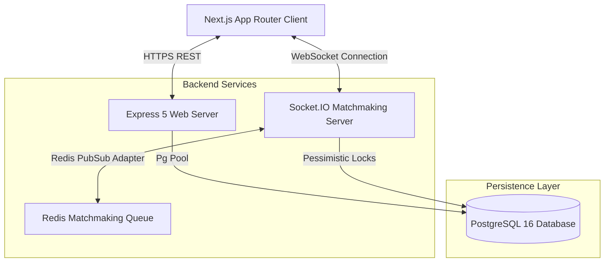

# 🏆 EduQuest: Learning, Coding & Matchmaking Battle Arena

<div align="center">

```
  ______    _         ____                  _   
 |  ____|  | |       / __ \                | |  
 | |__   __| |_   _ | |  | | _   _   ___  __| |_ 
 |  __| / _` | | | || |  | || | | | / _ \/ _` __|
 | |___| (_| | |_| || |__| || |_| ||  __/ (_| |_ 
 |______\__,_|\__,_| \___\_\ \__,_| \___|\__,___|
                                                 
```

[](https://github.com/ishukr41/eduquest)
[](https://github.com/ishukr41/eduquest)
[](https://github.com/ishukr41/eduquest)
[](https://github.com/ishukr41/eduquest)

**EduQuest** is an elite, gamified educational platform built for Indian students from Class 9 to Class 12 and Engineering learners. It blends the consistency tracking of LeetCode, the streak mechanics of GitHub/Duolingo, and the competitive excitement of real-time 1v1 quiz matchmaking (inspired by BGMI) into one unified, minimalist, and ultra-high-performance web application.

[Explore Platform Features](#-core-features) • [View Architecture](#%EF%B8%8F-system-architecture) • [Getting Started](#-getting-started) • [Deployment Checklist](#-production-deployment-checklist)

</div>

---

## 🚀 Core Features

### 🎮 BGMI-Style Battle Arena (1v1)
*   **Real-time Matchmaking**: Automatically groups students based on class levels and matches them against peers within ±3 levels.
*   **Simultaneous Quizzes**: Both competitors solve the same set of 10 CBSE/coding questions with a live 30-second ticking clock.
*   **Dynamic Response Grading**: Awards bonus points for speed and accuracy. Correct answers emit success sounds, while wrong answers trigger visual shake cues.
*   **Sparks virtual economy**: Level 10+ students can participate in casual or ranked arenas, earning non-cash trophies, certificates, and badges.

### 📅 Day-Wise Structured Learning
*   **CBSE Class 9–12**: Full coverage of Mathematics, Physics, Chemistry, Biology, Social Science, English, and regional languages chapter-by-chapter.
*   **Engineering Track**: Detailed N-day plans (C, C++, Java, Python, JavaScript, TypeScript, SQL, Rust, Swift, and Kotlin) from basics to interview-ready DSA.
*   **YouTube Solution Walkthroughs**: A direct explanation video is mapped below every single question to assist learners instantly.

### 🛡️ Secure College Events Portal
*   **Organizer Verification**: Colleges, teachers, and student clubs can onboard as verified hosts to organize coding and academic tournaments.
*   **Anti-Cheat Environment**: Restricts copy-paste commands during exams. Active tab-focus and proctoring controls warn of cheating attempts with direct score penalties.

---

## 🗺️ Monorepo Directory Layout

The codebase uses a clean ownership boundary separating the client layout, the Express WebSocket gateway, database models, and documentation assets.

```
eduquest/
├── backend/                       [Stateless Express 5 API Server + Socket.IO]
│   ├── prisma/                    [PostgreSQL schema models & Prisma client]
│   ├── src/
│   │   ├── config/                [Database pool config, Redis client singleton]
│   │   ├── routes/                [Auth, battle, community, event, wallet APIs]
│   │   ├── services/              [BGMI-style matchmaking & Socket.IO battles]
│   │   └── index.ts               [Graceful-shutdown server bootstrapper]
│   ├── package.json
│   └── tsconfig.json
│
├── frontend/                      [Next.js App Router Client Boundary]
│   ├── public/                    [PNG heroes, SVG vector icons, local audio assets]
│   ├── src/
│   │   ├── app/                   [Class-specific pages, community feed, test route]
│   │   │   ├── page.tsx           [High-impact dark mode landing page]
│   │   │   └── globals.css        [Visual tokens, glass-cards, skeleton shimmer]
│   │   ├── components/            [Modular navigation bars, footer shell, avatars]
│   │   └── lib/                   [Client store slices & JSON/Postgres persistence]
│   ├── package.json
│   └── tsconfig.json
│
└── docs/                          [Technical specifications & deployment guides]
    ├── IMPLEMENTATION_STATUS.md   [Core status of real vs. mockup endpoints]
    └── PRODUCTION_DEPLOYMENT.md   [Zero-downtime cluster launch checklist]
```

---

## ⚡ System Architecture

EduQuest is engineered to easily support **10,000+ concurrent active learners** through a stateless horizontal-scaling architecture.



### Technical Highlights
*   **Stateless Scaling**: Multiple backend API nodes can run behind an ALB. WebSockets use a Redis adapter to sync state across nodes.
*   **Data Resiliency**: Leverages a dual-persistence adapter model. Runs seamlessly locally using a lightweight JSON-file store when offline, and automatically unlocks PostgreSQL transactions in production.
*   **Zero-Overhead Styling**: Built using Vanilla CSS variables and `@tailwindcss/postcss` for maximum styling control and lighting-fast client paint speeds.

---

## 💻 Getting Started

Ensure you have [Node.js v20+](https://nodejs.org/) installed on your machine.

### 1. Initialize the Monorepo
Clone the repository and set up the dependencies:
```bash
# Clone the project
git clone https://github.com/ishukr41/eduquest.git
cd eduquest
```

### 2. Configure Environment Variables
Create a `.env` file in the `frontend` and `backend` subfolders using their respective `.env.example` configurations.

### 3. Running Locally (JSON Local Store Mode)
You can run the frontend client immediately. It will fallback to the secure JSON adapter and persist data locally without needing external servers:
```bash
# Boot the Next.js development server
cd frontend
npm run dev
```
Open [http://localhost:3000](http://localhost:3000) to view the application!

### 4. Running the full stack (PostgreSQL + Express + WebSockets)
To run with a real database:
1. Configure your local `DATABASE_URL` in both `.env` files.
2. Build the schemas and boot the servers:
```bash
# Generate Prisma Client & Run Backend Migrations
cd backend
npm run db:generate
npm run db:migrate

# Seed demo CBSE curriculum and initial data
npm run seed

# Run the Express WebSocket Server
npm run dev
```

In a separate terminal, boot the frontend:
```bash
cd frontend
npm run dev
```
Access the WebSocket battle arena, real-time leaderboard, and community feed at `http://localhost:3000`.

---

## 📋 Production Deployment Checklist

Ready to go live to 10k+ students? Follow this zero-downtime deployment guide:

### 1. Verification Gates
Ensure all typechecks, linting configurations, and builds compile flawlessly:
```bash
# Run client-side checks
cd frontend
npm run typecheck
npm run lint
npm run build

# Run server-side checks
cd backend
npx tsc --noEmit
npm run build
```

### 2. Production Environment Settings
Ensure your hosting provider (Vercel, AWS ECS, or Render) is configured with the following production keys:
*   `NODE_ENV=production`
*   `EDUQUEST_SESSION_SECRET` (Use a cryptographically secure 32+ character key)
*   `EDUQUEST_PERSISTENCE_ADAPTER=postgres`
*   `DATABASE_URL` (Points to a high-capacity PostgreSQL instance)
*   `EDUQUEST_RATE_LIMIT_ADAPTER=redis`
*   `REDIS_URL` (Points to a managed Redis instance for matchmaking queues)

### 3. Graceful Shutdown & Scale
The server has built-in event listeners for `SIGTERM` and `SIGINT`, shutting down database pools and releasing active connections cleanly within a 30-second window to prevent connection leaks during rollbacks.

---

## 📄 License & Ownership
Copyright © 2026 EduQuest Team. All rights reserved. Registered under standard commercial learning agreements.
